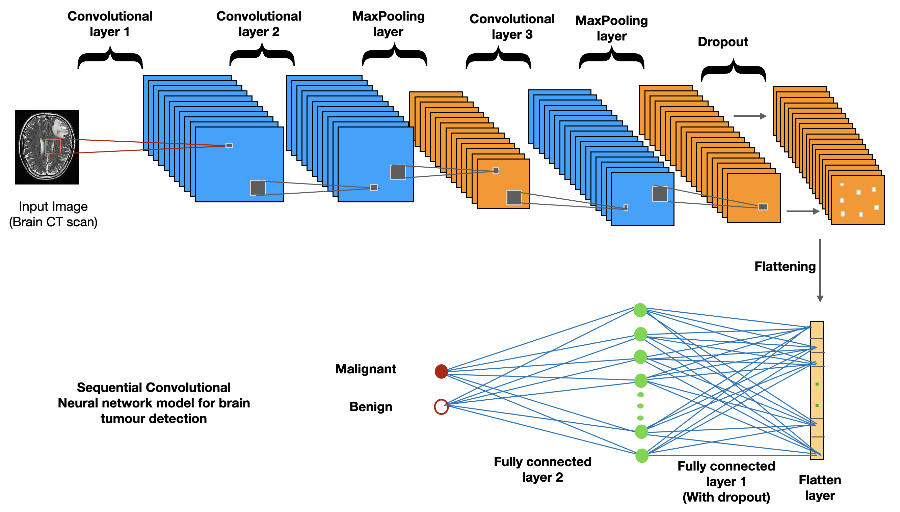

### Our goal is to apply deep learning convolutional neural network algorithm and build a model that allows us to classify brain tumor CT scanned images into healthy or tumorous sample.

We use keras library and train the model using Sequential method. \
The original images of brain are converted into a matrix data using function "ImageDataGenerator" defined in keras library.

The final project deployed on AWS server can be accessed via the following link:
[AWS Web APP Machine Learning](https://uw44cshh4a23jlvucfhjbyllye0lvsfb.lambda-url.us-east-1.on.aws)

### (1) Using custom build CNN architecture 
       To view this project click on "main_cnn.ipynb"
    
### (2) Using ResNet50 CNN architecture
        To view this project click on "main_cnn_resnet50.ipynb"

Our custom build CNN architecture outperforms ResNet50 model predictions.

### The following is the CNN architecture used in the training of brain tumor image data:
