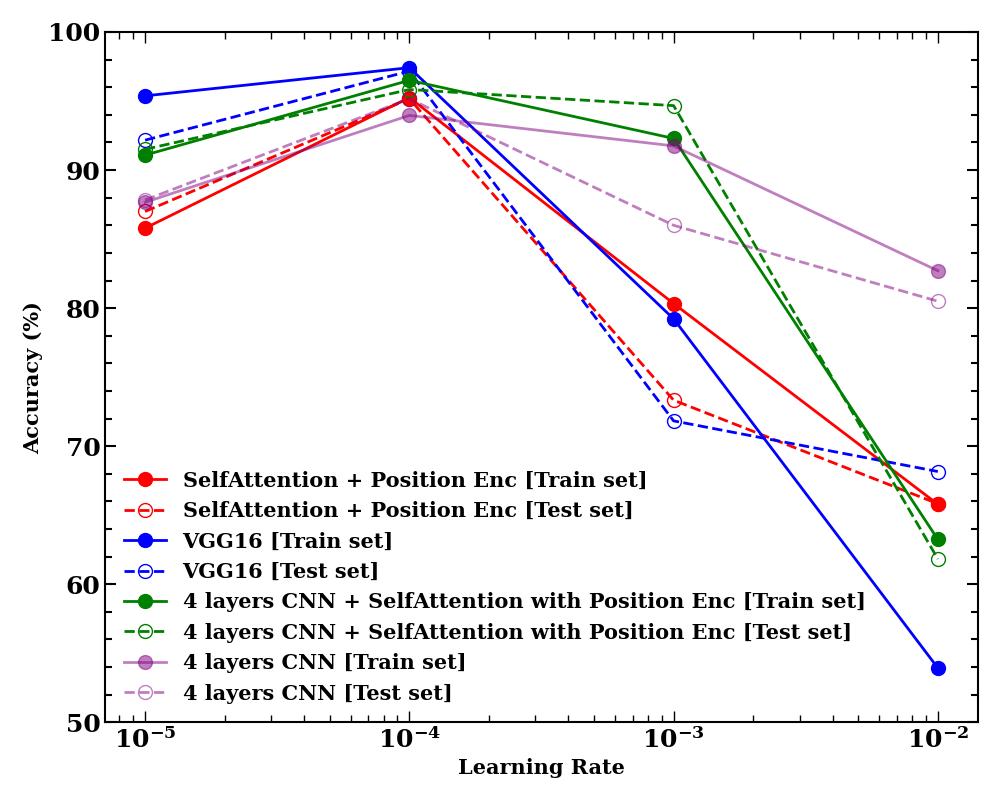

## Brain Tumor detection project using self-attention module (PyTorch)

### Goal: 

The goal of this project is to build CT scan tumor detection app using **self-attention module** and compare the performance with traditional **VGG16** architecture. We deploy the app on the **Google Cloud Run**, **Google Kubernetes Engine** and **AWS platform** to explore technical challenges involved in deploying **PyTorch** model on **AWS** and **Google Cloud** servers.

### 1. How to run the code in the terminal:

  		git clone https://github.com/amitkr2410/MachineLearning.git
  		
    	cd MachineLearning/PyTorch_BrainTumor
    	
    	python master.py 

### 2. or, run on Google Cloud (Collab) for free: Google Compute Engine T4 GPU:

a. Upload the code **"PyTorch_BrainTumor"** on **Google Drive**

b. Open **Google Collaboratory jupyter notebook** and Mount the code **"PyTorch_BrainTumor"**

c. Connect to **T4 gpu machine** 

d. execute the following command on python cell:
       
       	!cd  /content/drive/MyDrive/PyTorch_BrainTumor ; python master.py
 Note the exclamation **"!"** symbol in the command above, it is very important -- It tells the compiler that it's a bash/shell command.
 Also, I assume that we uploaded  **"PyTorch_BrainTumor"** directory in **"MyDrive"** of **Google Drive**.

### 3. Pre-requesites:
The **PyTorch** library heavily rely on **object-oriented programming** concepts such as **class**, **object** and **inheritance**. Make sure you have basic understanding of these conecpts.
    
### 4.  File Descriptions:  
 
    	master.py: This a top-level scripts which runs the machine learning model from 
    	           beginning to the end: initialize run parameters, data download stage,
    	           data augmentation and preprocessing stage, trainging the model
    	           and then, finally saving the model and run parameters.
    	 
    	params.yaml: File to specify the value of input parameters for the current run.
    	             Open the file "src/parameters.py" to view the list of the parameters.
    	                 	
    	TerminalOutput/: It is a directory where we can store the terminal output. 
    	                 It is useful for checks and verification.
    	
    	src/data_download.py: Script to download the brain tumor labelled CT scan image 
    	                      data files. We organize the input data files into train set, 
    	                      test set, and predict set.
    	 
    	src/initialize.py: Script reads input yaml file **params.yaml** and override the 
    	                   input parameter values set in the scripts "src/parameters.py".
    	
    	src/parameters.py: Contains all the run parameters required for the project. 
    	                   The parameters are defined as class variables and are passed
    	                   to each stage of the analysis as a function argument.
    	
    	src/preprocess.py: Script to  apply various transformations to the input image such
    	                   as: rotation, horizontal flip, vertical flip, normalization of image
    	                   pixel, and convert into tensor etc. Then, create "batch" of images
    	                   as a data loader using datasets library from torchvision.
    	 
    	
    	src/model_attention.py: Script where we create a model soley based on "self-attention"
    	                        and positional encoding. We also create a model where the image
    	                        is first passed throw 4 convolutional layers and then to
    	                        self-attention module.   	                         	
    	src/model.py:  Script where we define VGG16 model architecture. We also define a
    	               architecture that only has 4 convolutional layers.
    	
    	src/train.py: Script include training and validation stages of the model
    	
    	src/save_metric.py: Script to save all parameters/variables defined in "parameters.py"
    	                    into a text file including 'train accuracy, test accuracy, and loss'.

    	plots/EpochVsTrainAccuracy.py: Create a plot of model accuracy vs epoch.
    	
    	plots/LearningRateVsAccuracy.py: Create a plot of model accuracy as a function of 
    	                                 learning rate.

### 5. How to apply self-attention method to image processing:
 
The vision transformer was first introduced by Dosovitskiy and his colleagues from the Google Research Team in this paper "An Image is Worth 16x16 Words: Transformers for Image Recognition at Scale " in 2021 and has garnered wider attention from the machine learning community. In this project, we build a model based on self attention with positional encoding and apply it to image data. The main idea behind the vision transformer is to represent an image as a sequence of tokens. Each token represents a feature vector extracted from a patch of the image. These feature vectors are fed into transformer encoder block, which consists of the following: Embedding layer, positional encoding, multi-head self-attention, feedforward neural network, and layer normalization. However, in this project, we solely focus on self attention module with positonal encoding. 

In figure (a), we present a block diagram of our model architecture. The figure (b)  also represents the same model architecture but in addition we show how the image tensor changes as it passes through each block of the model architecture.  Firstly, The input image is passed through an adaptive average pooling layer. It reshapes the input image of an arbitary shape into an image with pixel 200x200. Now, we split the input image into patches and treat each patch as a word in a sentence (NLP transformer). The image tensor of each patch is transformed in such a way that it has 3 channel and 10x10 pixel -- This leads to a feature vector of size 300x1. We arrange patches in a row and label them with position index i=0,...., imax=399. The positional encoding vector is computed by applying sinusoidal transformation to patches with even index and cosine transformation to patches with odd index. We construct embedding vector by passing patch feature vector to a fully connect neural network layer (linear transformation), which is then added to positional encoding vector. For each patch, we compute Query, Key and Value vector. We compute the attention score by taking the dot product of the Query and Key vector, and scaled it by the dimension of the key vector. For a sequence with N input tokens there is a corresponding NxN matrix of attention scores. Next, We apply softmax activation to obtain the attention weights which are then multiplied with corresponding Value vectors and summed over. We apply this process to all patches.
The final image tensor is flatenned and passed to a fully connected layer to perform the final classification.
 
 

The VGG16 model was developed by "Simonyan and Zisserman" [Visual Geometry Group, 2015] at the University of Oxford. The model utilizes very small (3x3) convolution filter but very deep network consisting of 13 convolution layers followed by 3 fully connected layers. In this study, we also used VGG16 model to compare the performance with respect to the basic vision transformer.

### 6. Results:

We present the model accuracy as a function of hyperparameter "Learning Rate" for 4 different models. All models performs with the highest accuracy in range 95% to 97%. The peak accuracy is achieved in the vicinity approx 10e-4. 

 

In the plot below, we present the training and validation accuracy as a function of epoch. For the given data set, we observe a saturation in the model accuracy as we progress to higher values in the epoch.
Due to limited computational resources, we have computed the performance of the model upto epoch=20. The model architecture of VGG16 is significantly deeper and   performs with accuracy =97%, slightly higher compared to  basic vision transformer (95%) accuracy.

### 7. Model architecture:

   		(a) Self attention with positional encoding:
   
   		(b) VGG16:
   
   		(c) 4 layers CNN + self attention module with positional encoding:
   
   		(d) 4 layers CNN

### 8. Stages involved in buidling end-to-end application

    	(1) Define data pipelines and input parameter file
    	(2) Data download
    	(3) Preprocessing and Data Augmentation
    	(4) Define model
    	(5) Train the model
    	(6) Model validation
    	(7) Save the model and run parameters
    	(8) Host the model on the Cloud    

### 9. Data Source:  

The image data set used is from the following link:

                      https://www.kaggle.com/datasets/ahmedhamada0/brain-tumor-detection
 The data  consists of 3000 images with 1500 images for healthy brain and another 1500 images for patients with brain tumor.
                
### 10. Data Augmentation: 
We used **transform** and **datasets** class objects from **torchvision library**. We created dataloader objects with batches of images using torch library. We apply various transformations to the input image such
 as:  **rotation**,  **horizontal flip**,  **vertical flip**, and  **normalization** of image  pixel etc. Data augmentation helps in increasing the amount of training data. It helps in reducing  **overfitting**.

### 11. Model training: 
The hyper-parameters explored in this study: 

                            Learning rate = {0.01, 0.001, 0.0001, 0.00001} 
                            Weight decay = {0.002}

The VGG16 model performed with the highest accuracy of 97%

### 12. Training and Optimization:
To compare the predicted class probability with the ground truth labels, we use choose **Cross entropy loss** as a **loss function**. To perform the  **backpropagation** and optimize the model parameters, we employ  **Adam optimization** algorithm. In this work, we used **Google Compute Engine T4 GPU** to run the model and optimize the hyperparameters.

### 13. Deployment:
We present full instructions on how to deploy the final model on Google and AWS cloud here:

#### Host on Google Cloud Run:

			https://gcpimagee-rffjbusgsa-ue.a.run.app/

#### Host on Google Kubernetes:

			http://tinyurl.com/google-kubernetes-amit-pytorch

#### Host on AWS cloud: 

			https://iecusrbelq4pr5zjmdlsbgzbvy0kwait.lambda-url.us-east-1.on.aws/
		

### 14. Conclusion: 
The self-attention model with positional encoding gives excellent results and performs very similar to the VGG16 model with an accuracy in range 95-97%. Applying self-attention module to image data allows the model to capture long-range dependencies between different image regions -- This helps in improving the performance and achieving similar accuracy of the model. The model VGG16 is know to capture local features and spatial hierachies. 

In our calculation, we find the model file size for VGG16 model to be ~500MB, whereas for self-attention based model it was ~5 MB. This demonstrate the fact that the model size for basic vision transformer model is 100 times smaller than the VGG16 model, mainly due to less number of training parameters. The computational resource needed to train and deploy is smaller for basic vision transformer compared to VGG16 model.

 

