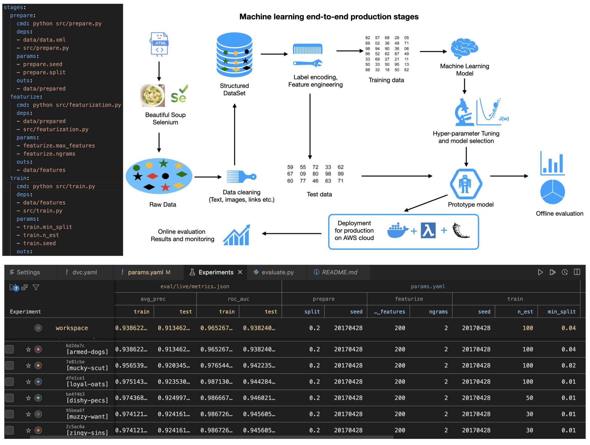

### Here, we apply Machine learning algorithms to build predictive model and build end-to-end application:

### The final project deployed on AWS server can be accessed via the following link (may take 2 mins to load website):
[AWS Web APP Machine Learning](https://uw44cshh4a23jlvucfhjbyllye0lvsfb.lambda-url.us-east-1.on.aws)
### The full website outlining projects can be accessed here (may take 2 mins to load website):
[Amit's Personal HomePage](https://tfzfmiug4if622cp6ml7dlqt2e0njauz.lambda-url.us-east-1.on.aws/)

For more information on deploying app on AWS using Flask, docker and Lambda function visit: 
https://github.com/amitkr2410/MachineLearning-Deployment

### For Machine learning experimentation, we build DVC pipelines. 
### In below, we present a typical ML architecture, a layout of DVC pipelines and ML experimentation for prototyping a model.

The projects can be viewed by clicking on the file with extension "*.ipynb" (JupyterNotebook). 

### Numerical regression and classification models explored are:
### (1) CNNTensorFlow- Deep learning 
    Classify brain tumor 2D scanned images into tumorus or healthy 
    sample using Convolutional neural network.
    We use keras library and train the model using 'Sequential method'. 
    The original images of brain are converted into a matrix data using
    function "ImageDataGenerator" defined in keras library. 
    We study the accuracy at each epoch of the model training. In the end, 
    we test the model againt known data and compute precision score and confusion 
    matrix to determine the validity of the model.
    To view the project click on "main_cnn.ipynb" or "main_cnn_resnet50.ipynb" 
    
### (2) Support vector Machine- SVM - Cancer cell data
    Introduction to SVM (Supervised machine learning technique) 
    Useful for classification, Regression, Outlier/Anomaly detection 
    Relevant Library to Import 
    Modeling Cancer data to predict whether a cell sample is benign or malignant.
    To view the project click on "main_svm.ipynb"

### (3) BERT based model: fine-tunning for Q/A
     In this project, we explore how to fine-tune ROBERTa transformer model.
     We fine tune on custom paragraphs for Q/A taks.
     View projects "fine_tune_RoBERT.ipynb"  and "main.ipynb"

### (4) Transformer_NLP Custom architecture
     In this implementation, we use single-head self-attention layer with positional encoding and construct a custom transformer moodel. We train the model on sentimental analysis data where the task is to classify the sentiment of text
     into positive, neutral and negative.
     View project file "TransformerScratch.ipynb"

### (5) NLP_automation_resume for HR management
     Natural language processing to classify a resume into a job category
     Read reasumes in pdf format using pdf2image ocr tool and convert it to
     PIL image, then use pytesseract.image_to_string to convert the image into strings 
     objects. For webscrapping, we used BeautifulSoup and Selenium driver.

     Next, we use natural language processing tools such as NLTK stopwords, regex, 
     string replace to get important words from the string.
     We also remove prefix and suffix using PorterStemmer in NLTK library.
     Then, we use CountVectorizer method and TfidfVectorizer method from sci-kit learn
     to create a independent feature vector.
     We use explore NaiveBayes model to train the data set. Compute confusion matrix.
     To view the project click on "Scrapping_resume.ipynb" and "NLP_modeling.ipynb"

### (6) NLP_Sentiment_twitter text data
     We apply Natural Language Processing (NLP) techniques to classify the sentiment
     of the text message as positive, neutral, or negative using Python. The text
     preprocessing is done using "stopwords" and "PorterStemmer"from NLTK corpus 
     library and then, "CountVectorizer" function is used to construct a 2d-matrix 
     from the text messages. The 2d-matrix is used to build the model for the 
     following different cases: 
     (a) Decision trees
     (b) Random Forest method
     (c) Logistic Regression model
     (d) Support vector classification (SVC)
     (e) xGBoost classifier
     (f) Naive Bayes
     We  compute the accuracy, precision, f1-score (confusion matrix) to determine the performance of the machine learning model.
     To view the project click on "NLP_Sentiment.ipynb"

### (7) BankCreditCardChurn data
     We apply statistical models: 
     (a) Decision trees
     (b) Random Forest method
     (c) Logistic Regression model
     (d) Support vector regression (SVR)
     (e) KNeighbors regression
     (f) xGBoost regression
     to study feature and corrleations present 
     in the Customer chrun data at a Bank. We convert the predicted probabilities into
     binary group and compute the confusion matrix to determine the performance
     of the machine learning model.
     To view the project click on "CustomerChurn.ipynb"

### (8) NLP_DetectSpamEmail text data
     We apply Natural Language Processing (NLP) techniques to classify a text message 
     as a spam or good email (ham) using Python. The text preprocessing is done using 
     "stopwords" from NLTK corpus library and then, "CountVectorizer" function is used 
     to construct a 2d-matrix from the text messages. The 2d-matrix is used to build 
     the model
     for the following different cases: 
     (a) Decision trees
     (b) Random Forest method
     (c) Logistic Regression model
     (d) Support vector classification (SVC)
     (e) xGBoost classifier
     We  compute the confusion matrix to determine the performance
     of the machine learning model.
     To view the project click on "NLP_DetectSpamEmail.ipynb"
     
### (9) MultiProjectRegressionModel 
    In this project, we do exploratry study of the data 
    Things to check: shape/size of data, nulls for missing values, types of coloumns 
    Use sci-kit library's SimpleImputer and OneHotEncoder to do preprocessing of the 
    data 
    Perform analysis to look for a trend in the data 
    Build Linear or polynomial regression model on the training data
    To view the project click on "Project0_KaggleProject_ExploreData.ipynb"
    or "Project1_PreprocessingAndRegression.ipynb" or "Project2_RegressionLinearPoly.ipynb"
    
### (10) WebScrappingBS4  
     We use python library called "BeautifulSoup" to do webscrapping. 
     In the end we use seaborn library to make a bar graph.
     To view the project click on "WebScrappingBS4.ipynb"
