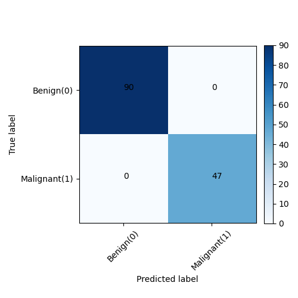

## Classify cancer cell samples as benign (non-cancerous) or malignant (cancerous) using Support vector machine (SVM) algorithm
### Goal:
Our goal is to build a SVM model by training the data for human cells into benign or malignant state. The Data is from http://archive.ics.uci.edu/ml/datasets/Breast+Cancer+Wisconsin+%28Original%29.  The formatted data was downloaded from here https://s3-api.us-geo.objectstorage.softlayer.net/cf-courses-data/CognitiveClass/ML0101ENv3/labs/cell_samples.csv 

 In SVM, the data points are classified by constructing hyperplanes between them in a higher-dimensional feature space, it is useful when the data is not linearly separable. The construction of hyperplane  depends on the choice of the kernel funnction used and is the most important model parameter you can tune. "Kernel" refers to a method of using linear classifier to a non-linear problem. The kernal functions maps the original non-linear observations into a higher-dimesional space which then become separable. 
```
We shall apply various SVM kernel to explore the differences. 
Linear, Polynomial, RBF, Sigmoid
Within kernel function, there are two regularization parameters: C and \gamma
Steps to model the data file "cell_samples_for_svm.csv":

(1) Import python library
(2) Description of data: shape, size, type, null
(3) Constructing training set and test test using sci-kit library
(4) Training model using 4 different Kernels in SVM and making inteference 
```

## Four common kernels in SVM:

 | Kernel Name | Formula $K(x_{n},x_{i})$ used in Kerneling  |Optimization Parameter|
 |----------------|:----------------|:----------------|
 |  Linear    |$K(x_{n},x_{i})=(x_{n},x_{i})$  | C,$\gamma$ |
 | Polynomial |$K(x_{n},x_{i})=(\gamma(x_{n},x_{i})+r)^{d}$    |C,$\gamma$, r, d |
 | RBF        |$K(x_{n},x_{i})=\exp(-\gamma \times mod(x_{n}-x_{i})^{2})+C$  | C,$\gamma$ |
 | Sigmoid    |$K(x_{n},x_{i})=\exp(-\gamma \times mod (x_{n}-x_{i})^{2})+C$  | C, $\gamma$, r| 


 The final project deployed on AWS server can be accessed via the following link:
[AWS Web APP Machine Learning](https://uw44cshh4a23jlvucfhjbyllye0lvsfb.lambda-url.us-east-1.on.aws)

For more information also visit: 
https://github.com/amitkr2410/MachineLearning-Deployment

### For Machine learning experimentation, we build DVC pipelines. 
### In below, we present the ML architecture and stages involved in this project:


### Hyperparameters exploration is presented below:


### Correlation matrix is presented below:


### Evaluation of the best model on unseen test data
